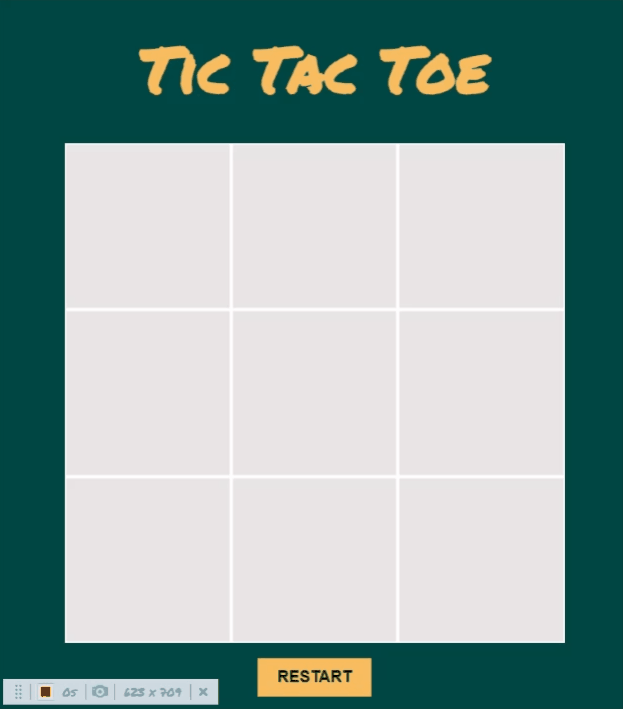

# Tic Tac Toe

    

<a href="https://noasalgado.github.io/Tic-Tac-Toe/">Live Demo </a>

## About The Project

Basic implementation of the classic Tic Tac Toe game with two players

I`ve done this project as part of the [Odin Project](https://www.theodinproject.com/lessons/node-path-javascript-tic-tac-toe) curriculum

## Built With

-   HTML 5
-   CSS
-   JavaScript, using factory functions and module pattern
